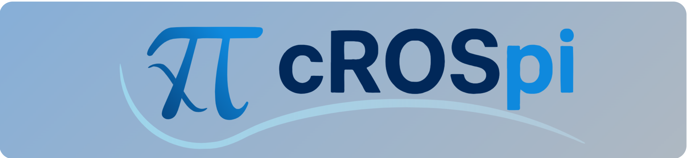

[Under development]

Supports only ROS2 humble and later versions

This package was created to be able to develop constraint-based reactive robot behaviors with eTaSL that can fully operate with the ROS2 architecture (without the need of Orocos). Several software tools are provided such that creation of complex reactive robotic behaviors can be deployed easily in different applications.

## Documentation

For documentation and tutorials, checkout our [crospi website](https://crospi-website-907f83.pages.gitlab.kuleuven.be/).

## License and acknowledgements

Published under the [GNU LESSER GENERAL PUBLIC LICENSE](LICENSE) Version 3, 29 June 2007.

This work was funded by the European Union’s Horizon 2020 research and innovation program 
under the grant agreement No. <a href="https://cordis.europa.eu/project/id/101058589">101058589</a> ( <a href="https://aiprism.eu/">AI-Prism</a>) 

## Authors

(c) 2025, KU Leuven, Department of Mechanical Engineering, ROB-Group:

- [Santiago Iregui Rincon](https://www.kuleuven.be/wieiswie/en/person/00125886)
- [Erwin Aertbeliën](https://www.kuleuven.be/wieiswie/en/person/00002405)
- [Federico Ulloa Rios](https://www.kuleuven.be/wieiswie/en/person/00141400)
